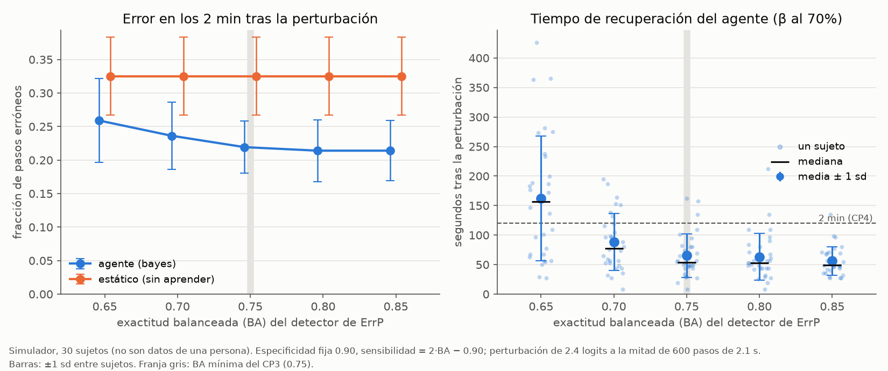
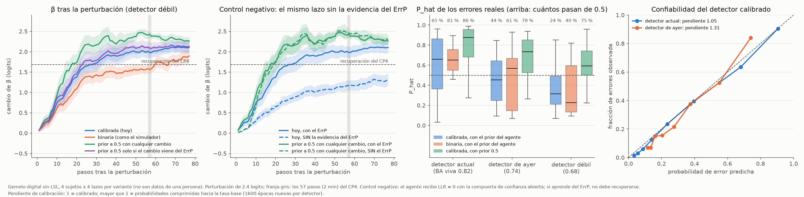
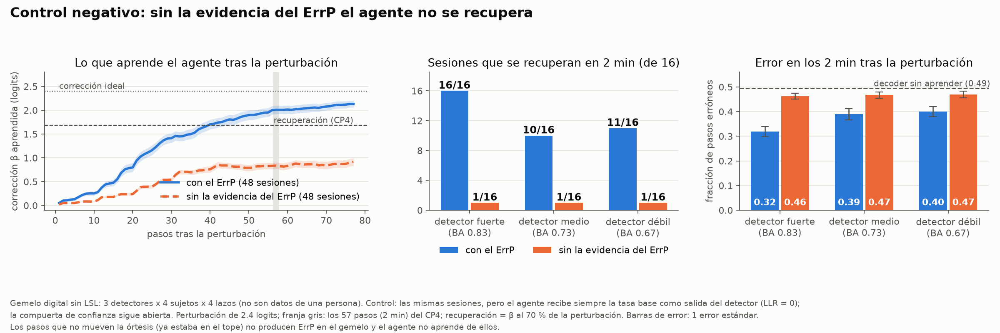
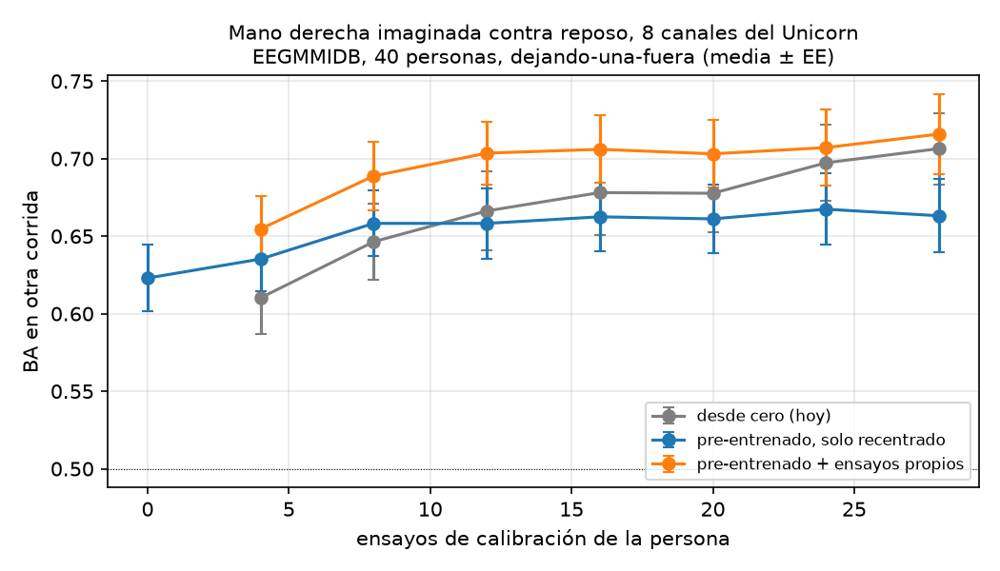
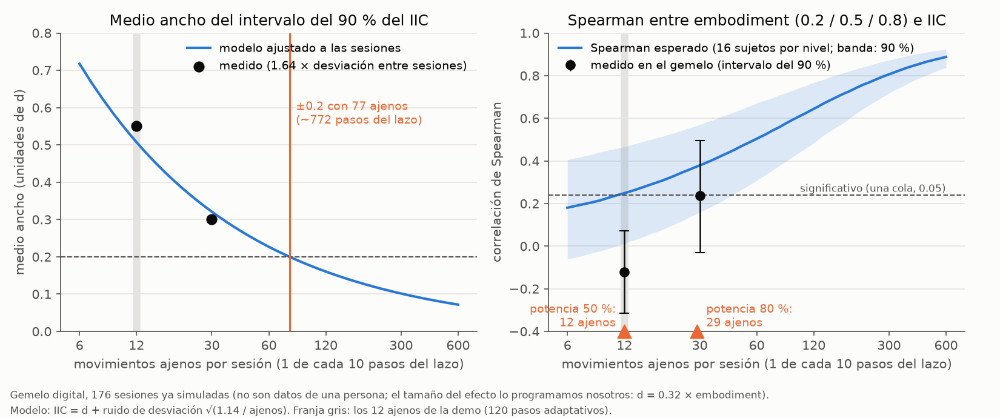

# ortesis-bci

Órtesis de mano controlada por imaginación motora, con un agente que se corrige solo usando el **potencial de error (ErrP)** del cerebro como recompensa.

## Tres escalas de aprendizaje

El sistema aprende en tres escalas de tiempo, y en las tres la última palabra sobre lo que cambia la tiene una regla explícita o una persona:

| Escala | Quién aprende | Cada cuánto | De qué aprende | Estado |
|---|---|---|---|---|
| Rápida | El **agente bayesiano** (`agente_errp.py`) | cada paso (~2 s) | Del ErrP del piloto: corrige el sesgo del decoder | En la demo |
| Media | El **detector co-adaptativo** (`hardware.DetectorCoadaptativo`) | cada ~20 pasos | De las épocas del propio lazo: se re-entrena y se prueba en sombra antes de entrar | En la demo |
| Lenta | **Claude como co-investigador** (`ia.py`) | entre bloques y entre sesiones | De un resumen agregado del bloque: propone continuar, pausar, ajustar un parámetro o recalibrar | Apagado por defecto |

La escala lenta nunca toca el lazo de control: recibe solo métricas agregadas y anónimas (nunca EEG crudo), su propuesta se valida contra rangos seguros en `config.py` y **nada cambia sin que una persona la apruebe**. Sin llave o sin conexión, las mismas decisiones salen de reglas deterministas.

## Hardware

El casco de la demo es un **g.tec Unicorn Hybrid Black**: 8 canales de EEG a 250 Hz por Bluetooth, más acelerómetro y giroscopio de 3 ejes, batería, contador de muestras e indicador de validez. El contrato (`config.py`) usa su montaje y le da un papel a cada sensor:

| Sensores | Papel |
|---|---|
| C3, Cz, C4 | Imaginación motora (ERD mu/beta) |
| Fz, Cz, Pz | Potencial de error (ErrP) |
| PO7, Oz, PO8 | Respuesta visual al movimiento (Tarea 2) y alfa occipital (semáforo PILOTO) |
| Acelerómetro y giroscopio | Rechazo de artefactos por movimiento de cabeza |
| Contador de muestras | Hora de cada muestra y pérdidas de Bluetooth |

La calibración real decidirá, por validación cruzada, si cada modelo usa los canales de su papel o los 8. El gemelo ya se comporta como un Unicorn (montaje, respuesta visual occipital, IMU, contador y pérdidas de Bluetooth) y puede publicar en el formato del puente o en el de la app UnicornLSL. La selección de canales en la calibración, el CP1 sin impedancias (calidad de señal por canal y latencia del ACK) y el rechazo por movimiento de cabeza ya están implementados; **nada se ha probado todavía con el casco** (`verificar_unicorn.py` es lo primero el domingo).

El orquestador puede leer el EEG de dos fuentes (`--fuente`): `puente` (por defecto: `puente_lsl.py` o el gemelo; flujos `EEG` e `IMU`) o `unicornlsl` (la app de g.tec: un flujo de tipo `Data` con 17 canales, que se resuelve por tipo o con `--eeg-nombre <nombre o número de serie>`). Solo una aplicación puede conectarse al casco a la vez.

## Instalación

```bash
python -m venv .venv
source .venv/Scripts/activate        # Git Bash en Windows (en CMD: .venv\Scripts\activate)
pip install -r requirements.txt
python pruebas.py                    # debe decir 54/54 pruebas pasaron
```

## Archivos

| Archivo | Qué hace |
|---|---|
| `config.py` | **El contrato**: flujos LSL, marcadores, columnas del CSV, umbrales, protocolo del ESP32, estados. Nadie define estas cosas en otro lado. |
| `agente_errp.py` | Agente bayesiano + `ConfianzaDetector` (confiabilidad viva del detector de ErrP) + `SenalSham` (lo que recibe el agente en el bloque sham del control causal). |
| `simulador_lazo.py` | Piloto sintético para probar y comparar agentes sin casco. |
| `orquestador.py` | Máquina de estados, calibraciones, checkpoints go/no go, lazo, CSV. Backends `sim` y `real`. Con `--sham`, control causal: bloque real contra bloque sham. |
| `hardware.py` | EEG por LSL, órtesis por USB (o simulada), decoder de MI con recentrado y detector de ErrP calibrado. |
| `puente_lsl.py` | BrainFlow → LSL: Unicorn (`--placa unicorn --serie <num>`), placa sintética, playback o Cyton. Publica `EEG` e `IMU` con la hora de cada muestra reconstruida por contador, y registra los huecos de Bluetooth. |
| `verificar_unicorn.py` | Con el casco puesto: comprueba orden de canales, unidades, contador, IMU, batería y validez, y dice qué fuente usar. |
| `bloque_sham.py` | Bloque sham (B1): con el piloto en reposo la órtesis se mueve al azar y `p(t)` del decoder no debe seguirla (`hardware.evaluar_sham`). |
| `cerebro_sintetico.py` | **Gemelo digital del piloto**: publica EEG por LSL que *reacciona* al lazo (ERD al imaginar, ErrP cuando la órtesis se equivoca, N1 visual atenuada según `--embodiment`). Reemplaza al casco para ensayar. |
| `embodiment.py` | Tarea 2 (exploratorio): N1 visual de cada movimiento e índice de integración corporal (IIC) con intervalo y tendencia. |
| `estudios/` | Mediciones offline con el gemelo y el simulador que respaldan cada decisión (ver su README). |
| `salud.py` | `Vigilante`: semáforo VERDE / AMARILLO / ROJO por subsistema (EEG, órtesis, reloj, detector y piloto, que solo avisa) y el retroceso de las reconexiones. |
| `caos.py` | `PlanCaos`: fallas reproducibles por semilla (ingeniería del caos aplicada al lazo). |
| `repetir_sesion.py` | Plan B: repite en el tablero, y si se quiere en la órtesis, una sesión grabada (`resultados/sesion_..._estado.jsonl`). |
| `verificar_ortesis.py` | Mide con la telemetría del ESP32 cuánto tarda la órtesis en empezar a moverse tras el ACK. |
| `ia.py` | Lo común a toda la IA: llave desde `.env`, lo que puede salir hacia la API (`sanear`), preguntas con herramientas, y el esquema, la validación y las reglas deterministas de las propuestas. Nada de esto corre dentro del lazo. |
| `copiloto.py` | Copiloto clínico: preguntas sobre una sesión respondidas con herramientas sobre su CSV, e informe entre sesiones. |
| `narrador.py` | Narrador para el jurado: proceso aparte que escucha `Estado` y publica una frase por evento relevante en el flujo `Narracion` (Claude, con plantillas de respaldo). |
| `tablero.py` | Tablero en vivo de 5 paneles, con cuatro semáforos en la cabecera (EEG, órtesis, detector y piloto), el aviso AUTOMATICO de los movimientos ajenos y una línea con el IIC. |
| `ver_flujos.py` | Diagnóstico: qué flujos LSL hay en la red y qué publican. |
| `pruebas.py` | Pruebas automáticas sin hardware. |

## Qué tiene de nuevo

**Agente (`agente_errp.py`)**

- **Kalman sobre `beta`.** La corrección del decoder tiene media y varianza; la varianza es la tasa de aprendizaje, así que no hay `eta` que elegir.
- **P_hat bayesiano con la confiabilidad *viva* del detector.** Con salida calibrada usa la probabilidad completa del ErrP y corrige el cambio de prior entre calibración y lazo.
- **Dos detectores de cambio** que re-inflan la varianza. El ErrP decide *qué* aprender; los detectores deciden *cuándo* aprender rápido.
  - *Sesgo de decisiones*: es rápido, y asume metas balanceadas.
  - *Chequeo predictivo*: el agente predice cuántos ErrP debería provocar según su confianza; si aparecen más, está seguro y equivocado. Funciona aunque las metas no estén balanceadas.
- **`ConfianzaDetector`.** Estima en vivo la sensibilidad y especificidad del detector de ErrP con posteriores Beta con olvido. El aprendizaje se escala con el índice de Youden y se congela si el detector deja de informar.
- **Un paso que no mueve la órtesis no enseña.** Con la órtesis ya en el tope, el paso siguiente no se ve, así que no hay ErrP que leer. Ese paso cuenta como decisión en el análisis, pero el agente no aprende de él y no cuenta como detección fallida para la confianza del detector (columna `alineacion = sin_movimiento`, marcador `paso_quieto:<seq>`, interruptor `config.IGNORAR_SIN_MOVIMIENTO`). En la calibración de ErrP la órtesis vuelve al centro cuando el movimiento no cabe en el recorrido: cada época tiene un movimiento real.

**Señal (`hardware.py`, `puente_lsl.py`)**

- **Recentrado riemanniano no supervisado.** El decoder de MI se re-centra solo con cada ventana. En la prueba, tras mezclar canales pasa de 50 % a 98 % de exactitud sin recalibrar.
- **Detector de ErrP de dos o tres vistas fusionadas** (temporal con LDA encogido, geométrica de Riemann y, opcional, potencia theta en Fz y Cz), con probabilidades calibradas, umbral de Neyman-Pearson (especificidad ≥ 0.90) y detector de rareza para épocas fuera de distribución. La calibración elige por validación cruzada anidada los canales (los de su papel o los 8) y las vistas, y registra la elección.
- **Época alineada al movimiento real.** La época del ErrP se corta donde la telemetría del ESP32 dice que la órtesis empezó a moverse. Sin telemetría usa el ACK más la latencia mecánica media medida; si tampoco la hay, el ACK. La columna `alineacion` del CSV dice cuál se usó en cada paso. Perder la telemetría cuesta, pero el lazo sigue: en el gemelo (`python estudios/respaldo_ack.py 4 4 ignorar`, 16 sesiones por escenario, con los topes del recorrido) la BA viva del detector baja de 0.86 a 0.72 si nunca hubo telemetría y a 0.81 si se pierde en el lazo; el error del agente en los 2 min tras perturbar pasa de 0.33 a 0.40 y a 0.34, y se recuperan 10 y 12 de 16 sesiones en lugar de las 16.
- **Detector co-adaptativo** (encendido por defecto; `--sin-coadaptativo` lo apaga). El detector se re-entrena en otro hilo cada 20 épocas del lazo, y el modelo nuevo solo reemplaza al vigente si en una prueba en sombra de 30 épocas no es peor. Ningún fallo del re-entrenamiento detiene el lazo: queda registrado en consola y en EVALUACION, y el lazo sigue con el modelo vigente; con tres fallos seguidos se apaga solo. En el gemelo (16 sesiones por detector, con los topes del recorrido) no empeora el error del agente: −0.005 ± 0.004 con el detector fuerte, −0.024 ± 0.012 con el medio y −0.008 ± 0.006 con el débil; sesión por sesión va de −0.14 a +0.05.
- **Calibración honesta.** MI se detiene sola cuando el intervalo de confianza ya decide (mínimo 36 ensayos); el detector de ErrP usa siempre 120 épocas con el umbral elegido por validación anidada (ver el hallazgo de la maldición del ganador).
- **Hora por contador.** La hora de cada muestra se reconstruye con el contador del casco, sin el jitter de llegada por Bluetooth; una pérdida queda como un hueco visible.

Resultados en simulación (30 sujetos, perturbación de 2.4 logits, `python simulador_lazo.py --semillas 30`; medidos en Windows 11 con Python 3.11 y repetidos el 3 de octubre de 2026 con la configuración final):

| Agente | Error antes | Primeros 2 min | Después |
|---|---|---|---|
| Estático (sin aprender) | 0.165 | 0.325 | 0.316 |
| `eta` fijo 0.3 | 0.170 | 0.246 | 0.178 |
| **Bayes (el nuestro)** | **0.169** | **0.214** | **0.175** |

Con el detector de ErrP degradado a propósito, el aprendizaje baja a menos del 10 % y se congela la mayor parte de la falla. Los congelamientos en falso son de 1 %.

**Curva de robustez** (simulador, 30 sujetos, `estudios/curva_robustez.py`): cuánto aguanta el agente un detector de ErrP peor. Con BA ≥ 0.75 la recuperación ya es casi plana; por debajo se alarga rápido. El decoder estático se queda en 0.325 de error en todos los casos.

| BA del detector | Error del agente, 2 min tras perturbar | Recuperación |
|---|---|---|
| 0.65 | 0.259 | 162 s |
| 0.70 | 0.236 | 88 s |
| 0.75 | 0.219 | 65 s |
| 0.80 | 0.214 | 63 s |
| 0.85 | 0.214 | 56 s |



## Gemelo digital del piloto

`cerebro_sintetico.py` sustituye al casco (un Unicorn Hybrid Black). Escucha las señales y los pasos del orquestador y responde como una persona: desincroniza mu/beta sobre C3 al imaginar cerrar, genera una respuesta visual occipital (N1 ≈ 170 ms en PO7/Oz/PO8) ante cada movimiento de la órtesis y un ErrP fronto-central (Ne ≈ 250 ms, Pe ≈ 350 ms en Fz/Cz/Pz) cuando va al lado contrario, parpadea, mueve la cabeza de vez en cuando (el giroscopio lo registra y el EEG se ensucia), pierde muestras por Bluetooth si se le pide y, opcionalmente, se cansa. Con él se valida el camino **real** completo con verdad conocida.

Corrida completa con la configuración final (`orquestador.py real --ortesis-sim` contra el cerebro sintético, una corrida, 3 de octubre): CP1 y CP2 en **GO** (MI BA 0.88 con 42 ensayos). El CP3 dio **NO GO** por especificidad (ErrP: sensibilidad 0.83, especificidad 0.87, BA 0.85 con 120 épocas; el criterio pide especificidad ≥ 0.90) y el lazo se corrió con ese detector. CP4 en **GO**: el agente recuperó en 28 pasos (50 s) y en los 2 min tras la perturbación quedó en 0.39 contra 0.54 de la sombra. 30 de los 138 pasos no movieron la órtesis. Es una sola corrida; la referencia con 16 sesiones por detector está en la sección del control negativo.

```bash
python cerebro_sintetico.py --banco          # decoder y detector offline, en segundos
python cerebro_sintetico.py                  # terminal 1 (en lugar de puente_lsl.py)
python cerebro_sintetico.py --erd 0.15 --errp 4 --fatiga 0.5   # piloto difícil
python cerebro_sintetico.py --perdidas-bt 20                   # 20 pérdidas de Bluetooth por minuto
python cerebro_sintetico.py --formato unicornlsl               # publica como la app UnicornLSL de g.tec
```

## Hallazgo: la calibración secuencial inflaba la exactitud (maldición del ganador)

**El síntoma.** En una sesión contra el gemelo, el detector de ErrP se calibró con especificidad 0.96 y en el lazo vivía en 0.72; el decoder de MI se calibró con BA 0.88 y el bloque estático tuvo 0.37 de error.

**Cómo lo encontró el gemelo.** Con ablaciones y sin LSL (`estudios/`) se descartó una a una cada sospecha: el recentrado en línea (±0.01 de error), las respuestas cerebrales a cada movimiento dentro de la ventana de MI (±0.01), el traslape de épocas con un paso cada 0.87 s (especificidad 0.95 contra 0.96 con 2.5 s) y una carrera entre mensajes en el gemelo (0 de 220 movimientos mal juzgados). Lo que sí apareció fue medir lo reportado en calibración contra lo real **en épocas nuevas** (16 sujetos del gemelo, montaje del Unicorn):

| Calibración del detector de ErrP | Sujetos | Reportado: sens / espec / BA | Real en épocas nuevas |
|---|---|---|---|
| Secuencial: GO temprano (40 a 60 épocas) | 2 de 16 | 0.84 / 0.90 / **0.87** | 0.56 / 0.81 / **0.69** |
| Secuencial: NO GO temprano (60 épocas) | 11 de 16 | BA 0.57 | con 120 épocas habría sido 0.72 |
| **Corregida: 120 épocas fijas y umbral anidado** | 16 de 16 | 0.51 / 0.89 / **0.70** | 0.56 / 0.89 / **0.73** |
| **Configuración final: además elige canales y vistas** | 16 de 16 | 0.72 / 0.91 / **0.81** | 0.72 / 0.90 / **0.81** |

La parada secuencial revisaba cada 10 épocas y daba GO en cuanto el estimado salía alto: con pocos datos eso solo ocurre por suerte, y además el umbral de Neyman-Pearson se elegía sobre los mismos puntajes que se evaluaban. Es la maldición del ganador: se reporta el máximo de varios estimados ruidosos. En MI el efecto era menor (+0.02 de error con un mínimo de 24 ensayos; +0.00 con 36).

**La corrección.** El detector de ErrP se calibra siempre con las 120 épocas, sin GO ni NO GO tempranos, y el umbral se elige dentro de cada pliegue (validación anidada): lo reportado queda a −0.02 ± 0.04 de lo real. MI exige al menos 36 ensayos. Además, el primer paso de cada ensayo fallaba más (0.22 contra 0.18) porque su ventana empezaba con la transición mental; esperar 1 s más tras la señal lo baja a 0.15. El resto del 0.37 era ruido: un bloque estático de 30 pasos tiene desviación de 0.08 (en vivo, con 150 pasos: BA 0.83 en calibración y 0.20 de error).

**El costo honesto.** Con el montaje del Unicorn (3 electrodos fronto-centrales), el ErrP del gemelo y el detector fijo de 8 canales y dos vistas, la BA real rondaba 0.73 y el CP3 (0.75) daba GO en 1 de 16 sujetos. Antes "pasaba" por el sesgo. Con la configuración final (la calibración elige canales y vistas, y el gemelo produce theta tras el error) la BA real es 0.81, lo reportado coincide con lo real (+0.00 ± 0.04) y el CP3 da GO en 8 de 16. Parte de esa mejora viene de la theta, que programamos nosotros. Son cifras del gemelo, no de una persona.

## Control negativo: el agente aprende del ErrP, y por eso su velocidad depende del detector

**El síntoma.** En tres corridas contra el gemelo, el agente tardó de 56 a 80 pasos en recuperarse de la perturbación y en dos de ellas empató con el decoder sin aprender; en el simulador tarda unos 20.

**Lo que se midió** (`estudios/agente_lento.py`: el lazo completo del gemelo sin LSL, con la misma aritmética del orquestador; 4 sujetos × 4 lazos por variante y el mismo ruido en todas). Error del agente en los 2 minutos tras perturbar (el decoder sin aprender queda en 0.49):

| Detector (BA viva) | Salida calibrada (la de hoy) | Salida binaria | Prior a 0.5 al detectar un cambio (descartada) |
|---|---|---|---|
| El actual (0.82) | 0.280 | 0.282 | 0.246 |
| El de aquellas corridas (0.74) | 0.294 | 0.312 | 0.257 |
| Uno débil (0.68) | 0.316 | 0.360 | 0.274 |

- **No era la salida calibrada.** La binaria no es más rápida, y con detector débil es peor (+0.044 ± 0.018). La calibración de Platt sí comprimía las probabilidades del detector de aquellas corridas (pendiente de calibración 1.31 contra 1.05 del actual), pero corregir eso apenas mejora (−0.016 ± 0.012).
- **Era la evidencia.** El agente calcula la probabilidad de haberse equivocado combinando su prior de error (~0.23) con lo que dice el detector. Con ese prior, un error solo lo convence (probabilidad mayor que 0.5) si el detector es rotundo: pasa con el 65 % de los errores con el detector actual, con el 44 % con el de aquellas corridas y con el 24 % con el débil.
- **La corrección tentadora se descartó.** Subir el prior a 0.5 cuando se detecta un cambio es la variante más rápida de la tabla, pero **falla el control negativo**: si al agente se le quita la evidencia del ErrP (recibe siempre la tasa base), se recupera igual, 16 de 16 sesiones. Lo que lo mueve ahí es el detector de sesgo, que supone metas balanceadas, y no el cerebro del piloto. En el simulador, con un detector sin información, pasa lo mismo: 30 de 30 sujetos.
- **El agente de hoy pasa ese control.** Sin la evidencia del ErrP casi no se recupera: 4 de 16 sesiones contra 13 de 16 con el detector débil, y su error sube +0.121 ± 0.019 (medido con todo paso visible; con los topes del recorrido, más abajo, es 1 de 16 contra 10 a 16). Por eso no se cambió: su velocidad depende de la calidad del detector, como muestra la curva de robustez, y eso es justo lo que afirma el proyecto.



Son cifras del gemelo, no de una persona. Parte de la mejora del detector actual viene de la actividad theta tras el error, que programamos nosotros.

### Los pasos que no mueven la órtesis (3 de octubre, tarde)

**El hueco.** Cada ensayo empieza en el punto medio y da 5 pasos de hasta 0.30 del recorrido. Con un decoder seguro la órtesis llega al tope en el segundo paso y los siguientes no la mueven; tras la perturbación pasa lo mismo hacia el lado equivocado. En las sesiones contra el gemelo eso era del 14 al 28 % de los pasos. Una persona no ve nada en esos pasos y no produce ErrP, pero el gemelo reaccionaba al marcador del paso aunque la órtesis no se moviera. Por eso el estudio de arriba (y todas las corridas anteriores) eran optimistas, y el lazo tenía un defecto que el gemelo tapaba: leía esos pasos como "sin ErrP", lo que refuerza la decisión y cuenta como detección fallida.

**Lo que se midió** (`estudios/paso_sin_movimiento.py`: el mismo lazo sin LSL, con los topes del recorrido y un gemelo que no reacciona a lo que no se mueve; 16 sesiones por celda). Error del agente en los 2 minutos tras perturbar y sesiones que se recuperan en ese plazo (el decoder sin aprender queda en 0.49):

| Detector (BA viva) | Todo paso se ve (estudio de arriba) | Con topes, el lazo lee esos pasos (antes) | Con topes, el lazo los ignora (**hoy**) | Hoy, sin la evidencia del ErrP |
|---|---|---|---|---|
| Fuerte (0.83) | 0.280, 16 de 16 | 0.409, 9 de 16; congelado 21 % | **0.319, 16 de 16**; congelado 0 % | 0.463, 1 de 16 |
| Medio (0.73) | 0.294, 15 de 16 | 0.376, 11 de 16; congelado 13 % | **0.389, 10 de 16**; congelado 5 % | 0.467, 1 de 16 |
| Débil (0.67) | 0.316, 13 de 16 | 0.391, 7 de 16; congelado 26 % | **0.400, 11 de 16**; congelado 5 % | 0.469, 1 de 16 |

- **Un tercio de los pasos no informa** (31 a 36 % tras la perturbación), y eso cuesta: con el detector fuerte la recuperación pasa de 19 a 28 pasos, y con los otros dos se recuperan 10 u 11 sesiones de 16 en lugar de 13 a 15.
- **La corrección ayuda donde el detector es bueno.** Con el detector fuerte, leer esos pasos congelaba el aprendizaje 21 % del tiempo y solo se recuperaban 9 sesiones de 16; ignorándolos se recuperan las 16 y el error baja de 0.41 a 0.32. Con detector medio o débil el error no cambia (+0.01, dentro del error estándar de ±0.02); lo que cambia es que el aprendizaje ya casi no se congela en falso.
- **El control negativo se sostiene, y queda más limpio:** sin la evidencia del ErrP se recupera 1 sesión de 16 con cualquiera de los tres detectores; con ella, 10 a 16 de 16.



Sigue siendo el gemelo, no una persona. El simulador rápido (`simulador_lazo.py`, la curva de robustez) no modela los topes: ahí todo paso informa, y por eso recupera antes.

## Control causal en vivo: bloque real contra bloque sham (`--sham`)

El control negativo de arriba se midió fuera de línea. `--sham` lo lleva a la sesión, frente al jurado. En lugar del bloque adaptativo corren **dos bloques del mismo largo, uno real y uno sham, en orden al azar**:

- Cada bloque arranca con el agente reiniciado (beta, varianza y prior) y sin perturbación, y recibe la suya (2.4 logits) en el mismo paso (el 10, tras dos ensayos).
- En el bloque sham el agente aprende igual de rápido (fiabilidad fija en la calibrada, sin congelar), pero **no recibe la evidencia del ErrP**: recibe la tasa base de la calibración, que no dice nada del paso. El `ConfianzaDetector` sigue midiendo al detector, así que la BA viva se puede comparar entre bloques.
- **Ciego simple:** el piloto no sabe cuál bloque es cuál. La consola y el tablero dicen «A» y «B»; el tablero muestra cuál es el real solo cuando el operador pulsa *Revelar bloques*.
- El orden queda en el CSV (columna `bloque`) y en los marcadores `bloque:real` y `bloque:sham`. `EVALUACION` y el tablero comparan los bloques lado a lado: error tras perturbar con intervalo del 90 %, tiempo de recuperación y si se recuperó. El CP4 es el del bloque real.

```bash
python orquestador.py real --puerto COM4 --sham      # 60 pasos por bloque: unos 4 minutos los dos
python estudios/sham_gemelo.py                       # el criterio de aceptación en el gemelo (~2 min)
```

Medido en el gemelo sin LSL y con los topes del recorrido (`estudios/sham_gemelo.py`; 4 sujetos × 4 sesiones, 60 pasos por bloque, con los tres detectores del control negativo). **Es el gemelo, no una persona.**

| Detector | Qué recibe el agente en el sham | Real se recupera | Sham se recupera | Error tras perturbar, real / sham | Sham − real (IC 90 %) |
|---|---|---|---|---|---|
| actual | **sin evidencia del ErrP** (por defecto) | **16/16** (mediana 26 pasos) | **0/16** | 0.342 / 0.479 | **+0.136 [+0.111, +0.161]** |
| actual | `p_errp` permutados | 16/16 | 11/16 | 0.349 / 0.422 | +0.074 [+0.038, +0.106] |
| de ayer | sin evidencia del ErrP | 14/16 | 0/16 | 0.366 / 0.476 | +0.110 [+0.085, +0.136] |
| de ayer | `p_errp` permutados | 15/16 | 9/16 | 0.367 / 0.425 | +0.058 [+0.030, +0.084] |
| débil | sin evidencia del ErrP | 7/16 | 2/16 | 0.449 / 0.466 | +0.017 [−0.003, +0.036] |
| débil | `p_errp` permutados | 8/16 | 6/16 | 0.425 / 0.453 | +0.027 [−0.001, +0.057] |

El criterio de aceptación (real ≥ 12 de 16, sham ≤ 3 de 16 y una diferencia de error cuyo intervalo excluye el 0) **se cumple con el sham sin evidencia y los detectores actual y de ayer; no con el detector débil**, con el que el propio bloque real se recupera solo 7 veces de 16.

**Hallazgo: permutar los `p_errp` no sirve de sham para este agente.** El diseño original era darle al agente los `p_errp` del mismo bloque permutados entre los pasos recientes: misma distribución, sin relación con el error de cada paso. Así el sham se recupera en 11 de 16 sesiones. La razón: tras la perturbación casi todas las decisiones van hacia el mismo lado, y entonces la sola **tasa** de ErrP ya dice hacia dónde corregir, caiga cada ErrP en el paso que caiga. La permutación conserva la tasa, así que conserva la información. Lo que el agente usa del ErrP es, sobre todo, cuántos hay; la alineación paso a paso aporta menos (0.07 de error). Por eso el sham por defecto quita la evidencia en lugar de barajarla; el otro queda disponible con `--sham-fuente recientes`.

**Lo que una sola sesión puede mostrar.** Tras la perturbación quedan 50 pasos por bloque: la diferencia de error de una sesión tiene un intervalo de ±0.2 y casi nunca excluye el 0. Lo que se ve en vivo es si beta se recuperó en un bloque y no en el otro. En el simulador rápido el contraste de error es menor (la perturbación sube el error de la sombra a 0.30, no a 0.50), y ahí solo se comprueba la recuperación: 8 de 12 en el real contra 0 de 12 en el sham (`pruebas.py`, `orquestador_sham`).

**En vivo contra el gemelo, por LSL (4 sesiones reales completas con `--ortesis-sim`; pocas, y una sola calibración sirvió para tres de ellas).** El sham no se recuperó en ninguna. El bloque real se recuperó en 3 de 4:

| Sesión | Pasos por bloque | Detector (CP3) | Bloque real | Bloque sham |
|---|---|---|---|---|
| 1 | 60 | BA 0.89, GO | **no se recuperó** en los 50 pasos tras perturbar (beta llegó a 1.44 de 1.86) | no se recuperó |
| 2 | 80 | BA 0.72, NO GO (forzado) | se recuperó en 25 pasos (35 s) | no se recuperó |
| 3 | 80 | el de la sesión 2 | se recuperó en 46 pasos (69 s) | no se recuperó |
| 4 | 80 | el de la sesión 2 | se recuperó en 35 pasos (50 s) | no se recuperó |

En la sesión 1 solo 15 de los 50 pasos tras perturbar tuvieron una época útil: 27 no movieron la órtesis (con un decoder muy seguro llega al tope en dos pasos) y 8 fueron artefacto. **Con 60 pasos por bloque el margen en vivo es justo** (la recuperación de la sesión 3, a los 46 pasos, habría entrado por cuatro pasos); con `--sham-pasos 80` quedan 70 pasos tras perturbar y los dos bloques duran unos 5.6 minutos a 2.1 s por paso. El valor por defecto sigue en 60: alargarlo lo decide Luis.

**Crédito.** La idea de un bloque sham dentro de la sesión es de jusren (rama `b1-b2-sham-errp`). Su sham (`bloque_sham.py`) es otro control: con el piloto en reposo la órtesis se mueve sola y `p(t)` del decoder no debe seguirla. La implementación de `--sham` es distinta y propia. **Ojo con los nombres:** `bloque_sham.py` es el control de reposo de jusren; `orquestador.py --sham` es este control causal.

## Dos controles de especificidad (ideas de jusren)

jusren propuso en su rama `b1-b2-sham-errp` dos controles que faltaban; el crédito de las ideas es suyo. **Hoy hay dos implementaciones de cada uno en `main`**: la de jusren (su rama se fusionó el 3 de octubre; ver «Bloque sham y especificidad por dirección (B1 y B2)» más abajo: `bloque_sham.py`, `hardware.evaluar_sham` y `hardware.metricas_por_direccion`) y la de esta sección, escrita aparte el mismo día sin saber que la suya ya estaba fusionada. Conviven sin estorbarse; falta decidir con cuál se queda el proyecto. En qué difieren:

| | jusren | Esta sección |
|---|---|---|
| ErrP por dirección | Avisa si la diferencia de especificidad pasa de 0.05 | Prueba exacta de Fisher sobre las falsas alarmas (p < 0.05) |
| Órtesis sola con el piloto en reposo | Script aparte (`bloque_sham.py`), entre dos arranques del orquestador; AUC con intervalo bootstrap; ventana hasta 1.5 s tras el movimiento | Dentro del orquestador (`--control-reposo`), sin reiniciar; Mann-Whitney; ventana hasta 0.9 s, como en el lazo |

Al calibrar, la consola imprime las dos líneas por dirección (la de jusren y la de Fisher).

**ErrP por dirección (siempre, al calibrar).** Si el detector da más falsas alarmas cuando la órtesis cierra que cuando abre, el agente corregiría hacia un lado sin que el piloto haya visto un error. Tras la BA, la calibración imprime la sensibilidad y la especificidad de cada dirección (`hardware.errp_por_direccion`, sobre las predicciones de la validación anidada) y la prueba exacta de Fisher de que las falsas alarmas no dependen de la dirección. Solo avisa (p < 0.05), no da NO GO. Se decide con la prueba y no con un umbral sobre la diferencia porque, con unos 40 aciertos por dirección, una diferencia de especificidad de 0.05 es puro azar. Con datos sintéticos (`pruebas.py`): avisa en 191 de 200 calibraciones cuando las falsas alarmas son 30 % a un lado y 2 % al otro, y en 10 de 200 cuando son iguales.

**Control de reposo (`--control-reposo`, unos 2 minutos tras calibrar).** El piloto no imagina nada y la órtesis se mueve sola 40 veces desde el punto medio, la mitad a cerrar. La salida `p(t)` del decoder de imaginación motora no debe seguir a la órtesis: si la sigue, está leyendo los servos, los cables o la respuesta visual al movimiento, y el lazo «funcionaría» por el motivo equivocado. La ventana de MI termina 0.9 s después de cada movimiento, que es lo que ocurre en el lazo (la ventana de un paso alcanza al movimiento del paso anterior). `hardware.evaluar_reposo` da la AUC de `p` contra la dirección y la prueba de Mann-Whitney; solo avisa.

```bash
python orquestador.py real --puerto COM4 --control-reposo      # también con --saltar-calibracion
```

Medido en el gemelo sin LSL (EXPLORATORIO; `pruebas.py`, prueba `controles_especificidad`, 6 sujetos): con el piloto en reposo pasa en 6 de 6 (AUC 0.34 a 0.64); si el piloto imagina lo que hace la órtesis, se detecta en 6 de 6 (AUC 0.84 a 0.96). Con `p` independiente de la dirección da falsa alarma en ~5 % de las veces, como corresponde. **Falta probarlo con el casco: el gemelo no tiene ruido de servos, que es justo lo que este control busca.**

## Copiloto clínico (`copiloto.py`)

Preguntas en lenguaje natural sobre una sesión, respondidas **solo con sus datos**. El copiloto no ve el EEG: consulta cinco herramientas que leen el CSV de la sesión y su registro `_estado.jsonl` (eventos del flujo `Estado`, checkpoints y marcadores):

| Herramienta | Qué devuelve |
|---|---|
| `resumen_sesion()` | Pasos, error del agente y de la sombra por bloque, recuperación, excluidos, BA viva, congelamientos, cambios y checkpoints. |
| `eventos(desde, hasta, tipo)` | Pausas (con su causa), congelamientos, cambios detectados, perturbaciones, checkpoints y cambios de semáforo. |
| `metrica(nombre, bloque)` | Error con intervalos y la diferencia sombra − agente, tiempo de recuperación, BA viva, fiabilidad, latencia del ACK, excluidos por motivo, alfa occipital y errores sin ErrP según el tamaño del paso. |
| `pasos(desde, hasta, columnas)` | Filas puntuales del CSV, 40 como máximo por llamada. |
| `comparar_sesiones(rutas)` | Las cifras clave de esta sesión junto a las de otras (por defecto, la anterior). |

Toda respuesta cita los pasos y los valores que usó. Si el dato no existe, la herramienta lo dice («no hay dato: …») y el copiloto lo repite; nunca estima.

```bash
python copiloto.py --ultima "¿cuánto tardó en recuperarse tras la perturbación?"
python copiloto.py --sesion resultados/sesion_real_....csv          # modo interactivo
python tablero.py --copiloto                                        # caja de preguntas en el tablero
python copiloto.py --ultima --informe                               # informe entre sesiones
python copiloto.py --ultima --decidir aprobar                       # la propuesta la decide una persona
```

**Con y sin IA.** Con la llave en un archivo `.env` (`ANTHROPIC_API_KEY=...`; está en `.gitignore`) responde Claude (`claude-opus-5-5`) llamando a esas herramientas. Sin llave, sin conexión, o si la API falla o declina, responden plantillas deterministas sobre las mismas herramientas, y la respuesta lo dice. Las seis preguntas de prueba se responden de las dos formas: por qué se congeló el aprendizaje en el paso N, cuánto tardó en recuperarse, si el agente le ganó a la sombra y con qué certeza, si hubo señales de fatiga, cuántos pasos se excluyeron y por qué, y cómo se compara con la sesión anterior.

**Informe entre sesiones.** `--informe` compara la sesión con las anteriores (las tres previas del mismo tipo, o `--anteriores`) y escribe cuatro Markdown junto al CSV: para el terapeuta (cifras, tabla comparativa y propuesta) y para el paciente (lenguaje sencillo), en español y en inglés, con dos figuras. Las cifras siempre salen del código; con IA, Claude escribe solo el párrafo de interpretación. El informe incluye una **propuesta para la próxima sesión** en JSON, con el mismo esquema y los mismos rangos seguros que el co-investigador; queda pendiente en `sesion_..._propuestas.jsonl` hasta que una persona la apruebe o la rechace.

**Qué sale hacia la API.** Solo lo que devuelven las herramientas, y todo pasa por `ia.sanear`: quita las carpetas de las rutas (llevan el nombre de usuario de la máquina) y se niega a enviar una lista de más de 200 números, que sería una señal cruda. Los archivos de sesión no tienen nombres de personas.

**Sin probar con la API real:** el 3 de octubre no había llave en la máquina. Todo está probado con una API simulada (`pruebas.py`: `copiloto_herramientas` y `copiloto_api_simulada`); la primera llamada real hay que hacerla antes de encenderlo en la final.

## Co-investigador entre bloques (`--coinvestigador`)

La escala lenta del aprendizaje. Al terminar cada bloque, el orquestador:

1. **Resume el bloque** en cifras agregadas (`copiloto.resumen_para_propuesta`): exactitud, error contra la sombra con el intervalo de la diferencia, BA viva, fiabilidad media y fracción del bloque con el aprendizaje congelado, excluidos por motivo, alfa occipital, pasos sin movimiento y errores que pasaron sin ErrP según el tamaño del paso.
2. **Pide una propuesta** a Claude con esquema fijo (`ia.ESQUEMA_PROPUESTA`): una acción (`continuar`, `pausa`, `ajustar_parametro` o `recalibrar`), un parámetro y un valor si aplica, y una justificación breve. Sin llave, sin conexión o si la API tarda más de 20 s, propone un conjunto de reglas deterministas (`ia.propuesta_por_reglas`) con el mismo esquema.
3. **La valida** contra los rangos seguros de `config.PARAMETROS_PROPUESTA`. Una propuesta de la API que no cumple el esquema o se sale del rango se descarta (queda registrada con el motivo) y deciden las reglas.
4. **Se la muestra al operador** en el tablero, con los botones **Aprobar** y **Rechazar** (también vale `python copiloto.py --sesion <csv> --decidir aprobar` desde otra terminal). Espera la decisión hasta 60 s.
5. **Aplica el efecto solo si se aprobó**, y registra propuesta, decisión y efecto en `sesion_..._propuestas.jsonl`.

| Parámetro ajustable | Rango seguro | Qué es |
|---|---|---|
| `paso_visible` | 0.05 a 0.12 | El paso mínimo que se le muestra al piloto. |
| `paso_max` | 0.15 a 0.35 | El paso máximo: nunca más de un tercio del recorrido. |
| `ganancia` | 0.15 a 0.45 | Cuánto crece el paso con la confianza del decoder. |
| `ajenos_cada` | 0 a 20 | Movimientos ajenos de la Tarea 2 (0 = ninguno). |
| `pausa_s` (solo en `pausa`) | 30 a 300 s | Descanso con la órtesis abierta. |

**Lo que no puede pasar.** Nada cambia sin una aprobación: rechazada, o sin decisión a tiempo, la sesión sigue igual. No hay parámetros del aprendizaje del agente (prior, varianza, umbrales de cambio) en la lista. Entre los dos bloques del control causal no se ajusta nada aunque se apruebe (cambiaría las condiciones de la comparación), y ahí el resumen y el tablero solo dicen «bloque A» o «bloque B». `recalibrar` aprobado termina la sesión en orden y dice cómo relanzarla (`--solo-errp`). Tras el último bloque la propuesta se registra sin esperar decisión. La consulta ocurre entre bloques: dentro de un paso del lazo no corre nada de la IA.

```bash
python orquestador.py real --puerto COM4 --coinvestigador
```

Las reglas deterministas, en orden: pocos pasos válidos (< 30) → continuar; más de 25 % de filas excluidas → pausa para revisar el casco y la órtesis; alfa occipital ≥ 1.5 veces su línea base → pausa; BA viva < 0.60 o más de la mitad del bloque congelado → recalibrar; errores con pasos chicos que pasan sin ErrP 25 puntos más que con pasos grandes → subir `paso_visible` 0.02; si no, continuar. Los umbrales están en `config.REGLAS_PROPUESTA` y **no están validados con personas**.

Probado en el simulador con la API simulada (`pruebas.py`, `coinvestigador_entre_bloques`): aprobada, `paso_visible` pasa de 0.08 a 0.10 y el lazo lo usa desde el bloque siguiente; rechazada o sin decisión, nada cambia; una propuesta de `paso_max = 0.95` se descarta. **Sin probar con la API real.**

## Narrador para el jurado (`narrador.py`)

Un proceso aparte que escucha el flujo `Estado` y, cuando pasa algo que vale la pena contar, publica **una frase corta** en español o en inglés: checkpoints, la perturbación, la recuperación, el congelamiento del aprendizaje (y cuando se reanuda), las pausas seguras con su motivo (y cuando terminan) y el resultado del control causal.

```bash
python narrador.py --idioma en        # terminal aparte; imprime cada frase y la publica en el flujo LSL `Narracion`
python tablero.py --narrador          # franja con la última frase
```

- **Nunca bloquea el lazo:** es otro proceso y solo lee; el orquestador no sabe que existe.
- **Basado solo en los datos del evento.** Con llave, Claude recibe el evento (un puñado de cifras) y escribe la frase. Se descarta, y se usa la plantilla, si la API tarda más de 6 s, falla o declina, si la frase pasa de 220 caracteres, o **si trae una cifra que no está en el evento**. Un evento con más de 8 s de atraso ya no se le pregunta a la API: una frase tardía confunde.
- **Sin llave o sin conexión**, plantillas en los dos idiomas (`--sin-ia` las fuerza).
- **Respeta el ciego del control causal:** durante los bloques A y B no cuenta recuperaciones ni congelamientos, que delatarían cuál es el real; al final cuenta el resultado.

Probado con la API simulada (`pruebas.py`, `narrador_jurado`) y, con plantillas, contra una sesión del simulador en vivo por LSL. **Sin probar con la API real.**

## Transferencia desde PhysioNet: arrancar la calibración con un decoder pre-entrenado (`--preentrenado`)

¿Cuántos ensayos de calibración de imaginación motora ahorra empezar con un decoder entrenado con otras personas? Se midió con la **EEG Motor Movement/Imagery Database** (Schalk et al. 2004; PhysioNet, vía `mne.datasets.eegbci`): «mano derecha imaginada» contra «reposo» (corridas 4, 8 y 12), con los 8 canales del Unicorn remuestreados a 250 Hz y la misma ventana y banda del lazo. El decoder es el del proyecto (covarianzas → recentrado riemanniano → espacio tangente → regresión logística). El recentrado es lo que permite transferir: cada persona queda centrada en la identidad, así que un clasificador ajustado con otras se le aplica tal cual; la persona nueva solo aporta su centro, que sale de EEG **sin etiquetas** (su minuto de reposo, o sus propios ensayos).

Dejando una persona fuera cada vez (40 personas), calibrando con los primeros *n* ensayos de sus corridas 4 y 8 y probando siempre en su corrida 12 (`python estudios/transferencia_physionet.py`; media ± error estándar):

| Ensayos propios | Desde cero (hoy) | Pre-entrenado, solo recentrado | Pre-entrenado + ensayos propios | Diferencia con desde cero |
|---|---|---|---|---|
| 0 | — | **0.623 ± 0.021** | — | — |
| 4 | 0.610 ± 0.024 | 0.635 ± 0.021 | 0.655 ± 0.021 | +0.044 ± 0.023 |
| 8 | 0.646 ± 0.024 | 0.658 ± 0.021 | 0.689 ± 0.022 | +0.042 ± 0.023 |
| 12 | 0.666 ± 0.026 | 0.658 ± 0.023 | **0.704 ± 0.020** | +0.037 ± 0.021 |
| 16 | 0.678 ± 0.027 | 0.662 ± 0.022 | 0.706 ± 0.022 | +0.028 ± 0.023 |
| 20 | 0.678 ± 0.025 | 0.661 ± 0.022 | 0.703 ± 0.022 | +0.025 ± 0.020 |
| 24 | 0.697 ± 0.025 | 0.667 ± 0.023 | 0.707 ± 0.024 | +0.010 ± 0.020 |
| 28 | 0.706 ± 0.023 | 0.663 ± 0.024 | 0.716 ± 0.026 | +0.009 ± 0.020 |



**Lo que dice, sin adornos.** Funciona, pero ayuda poco. Sin un solo ensayo propio el decoder pre-entrenado ya decide con BA 0.62, lo que desde cero pide 8 ensayos. Con 12 ensayos propios llega a 0.70, lo que desde cero pide 28: **ahorra unos 16 ensayos, cerca de minuto y medio de calibración**. La ventaja es de unos 0.04 de BA con 4 a 12 ensayos (menos de dos errores estándar en cada punto) y desaparece hacia los 28. No es un atajo para saltarse la calibración: es un mejor punto de partida cuando hay pocos ensayos.

**Lo que no dice.** Son personas reales, pero no el piloto, ni el Unicorn (ahí son electrodos de gel de un equipo de 64 canales), ni la tarea exacta del proyecto (allí el «reposo» es el descanso entre ensayos, no «imagina que abres y relajas»). En el gemelo el decoder de PhysioNet, sin ensayos propios, da BA 0.79 en 8 sujetos (0.70 a 0.86): solo dice que el patrón aprendido de personas es el que programamos en el gemelo.

**Cómo se usa.** Apagado por defecto. El modelo no va en el repositorio (`modelos/` está en `.gitignore`): se genera una vez, con conexión.

```bash
python estudios/transferencia_physionet.py           # descarga 40 personas (~350 MB, lento) y mide
python estudios/transferencia_physionet.py modelo    # guarda modelos/decoder_preentrenado.pkl
python orquestador.py real --puerto COM4 --preentrenado
```

Con `--preentrenado`, la calibración de MI ajusta el clasificador con los ensayos de las otras personas más los del piloto (cada uno pesa como 20 de los otros) y usa los 8 canales, sin elegir entre C3/Cz/C4 y los 8. La BA que reporta el CP2 sigue siendo de validación cruzada sobre los ensayos del piloto, y el mínimo de 36 ensayos no cambia: bajarlo (`--min_mi`) acorta la calibración, pero el estimado con pocos ensayos vuelve a ser optimista (ver «la calibración secuencial inflaba la exactitud»).

## Resiliencia: el lazo que no se cae

Si se desconecta el dongle, se reinicia el ESP32, se congela LSL o llega una época corrupta, el sistema lo detecta, se protege, se recupera solo y no pierde la sesión.

**Semáforos (`salud.py`).** Antes de cada paso, el `Vigilante` revisa cinco subsistemas. Cada cambio de color sale en consola, en el flujo `Estado` y como marcador `salud:<subsistema>:<color>`. Los umbrales están en `config.SALUD`.

| Subsistema | Qué mide | AMARILLO | ROJO |
|---|---|---|---|
| EEG | edad de la última muestra, muestras que de verdad llegan, canales | 0.3 s sin muestras; 10 % menos muestras | 1 s sin muestras; 25 % menos; un canal plano, saturado o ruidoso |
| Órtesis | ACK perdidos, latencia, puerto | 1 ACK perdido; latencia ≥ 80 ms | 3 ACK perdidos seguidos; puerto caído |
| Reloj | deriva del retraso del EEG contra su línea base | 20 ms | 50 ms |
| Detector | fiabilidad viva del `ConfianzaDetector` | fiabilidad < 0.7 | aprendizaje congelado |
| Piloto (solo avisa) | alfa occipital (8–13 Hz en PO7/Oz/PO8, últimos 20 s) contra su línea base del primer minuto del lazo | ×1.5 | ×2.5 |

El detector empieza en `CALENTANDO` (gris en el tablero) hasta tener 15 épocas válidas: antes de eso su fiabilidad es ruido y no emite cambios. El piloto también, mientras mide su línea base. **El semáforo PILOTO solo avisa**: el alfa occipital sube con la somnolencia, los ojos cerrados o la desconexión de la tarea, pero no pausa, no excluye pasos y no cuenta en la escalera de degradación. Sus umbrales no están validados en personas. En el gemelo, con `--fatiga 1`, el alfa llega a ×2.8 a los 15 minutos (ROJO); sin fatiga se queda alrededor de ×1.

**Escalera de degradación**, de mejor a peor:

| Escalón | Condición | Qué hace el sistema |
|---|---|---|
| 1 | Todo en VERDE | Lazo normal. |
| 2 | Detector poco fiable o reloj en ROJO | El lazo sigue; el agente no aprende. |
| 3 | EEG perdido o canal despegado | `PAUSA_SEGURA`: la órtesis se abre despacio; consola y tablero dicen qué electrodo falla y por qué. |
| 4 | Órtesis perdida | `PAUSA_SEGURA` sin poder moverla: se registra, se avisa y se reconecta sola. |

De la pausa se sale sola tras 3 s continuos de EEG y órtesis en VERDE; se regresa al estado previo y se repite el cue del ensayo. Las pausas no consumen pasos del bloque.

**Qué queda fuera del análisis.** La columna `excluido` del CSV lleva el motivo; `EVALUACION` ignora esas filas y reporta cuántas fueron.

| Motivo | Significado |
|---|---|
| `pausa:eeg`, `pausa:canal`, `pausa:ortesis` | Fila de una pausa segura. |
| `sin_ack` | La órtesis no confirmó el movimiento: no hay instante desde el cual cortar la época. |
| `epoca_invalida` | La época cruza un corte de EEG o le faltan muestras. Las épocas se cortan por tiempo, no por número de muestras. |

**Reconexión automática**, con retroceso exponencial (0.5 s, 1, 2, 4, 8, 8...):

- `EntradaEEG` vuelve a resolver el flujo si se pierde; al reconectar vacía el buffer y reinicia el reloj. Si hay varios flujos iguales en la red (un gemelo olvidado en otra terminal), avisa, usa el más reciente y no salta a otro mientras el suyo siga publicado. La hora de cada muestra viene de la fuente, reconstruida con el contador del casco, y **no** se usa el suavizado de marcas de LSL: una pérdida de Bluetooth queda como un hueco en la hora, y tras un silencio las marcas siguen alineadas sin tener que vaciar el buffer. La ventana de imaginación motora tolera pérdidas chicas (hasta 10 % de las muestras y huecos de hasta 0.25 s, interpolados); la época de ErrP no cruza huecos de más de 20 ms.
- `OrtesisSerial` reabre el puerto y conserva `seq`. `mover()` nunca lanza una excepción.
- `puente_lsl.py` vuelve a preparar la placa si deja de entregar datos 2 s. **Probado solo con la placa sintética de BrainFlow; no probado con el Cyton real.**
- `puente_lsl.py` estampa cada muestra con la hora reconstruida por el contador de la placa e imprime cada 30 s un **registro de huecos**: ráfagas de muestras perdidas, su duración media y máxima, silencios de llegada y frecuencia por minuto. Sirve para medir el Bluetooth con el casco real.

**Calibración.** Un ensayo afectado por una falla se repite como máximo 3 veces (la consola dice por qué); después se avisa y la calibración sigue.

**Persistencia.** Después de cada paso se guarda una instantánea atómica en `resultados/estado_sesion.json`. Tras un cierre inesperado (o un `Ctrl+C`), el mismo comando con `--reanudar` continúa la misma sesión y el mismo CSV. En `real` carga los modelos guardados y no recalibra.

**Modo caos.** `--caos <semilla>` inyecta el "caos estándar" (`config.CAOS_ESTANDAR`), reproducible por semilla:

| Falla | Frecuencia | Detalle |
|---|---|---|
| Corte de EEG | uno cada ~45 s | 1 a 5 s; los de 3 s o más destruyen y recrean el flujo |
| ACK perdido | 3 % de los pasos | — |
| Pico de latencia | 5 % de los pasos | 80 a 300 ms |
| Ráfaga de parpadeos | una cada ~40 s | 2 a 4 s |
| Canal despegado | uno cada ~120 s | 4 a 10 s, plano o ruidoso |

```bash
python orquestador.py sim --ciclo 0 --caos 1                    # simulador con caos, en segundos
python cerebro_sintetico.py --caos 1                            # terminal 1: gemelo con caos
python orquestador.py real --ortesis-sim --forzar --caos 1      # terminal 3 (--forzar: el caos tumba el CP1)
python orquestador.py sim --ciclo 0 --caos 1 --caos-nivel leve  # caos leve: una falla cada 2 a 3 minutos
python orquestador.py real --puerto COM4 --reanudar             # continuar tras un cierre inesperado
```

**Resultados con caos (exploratorios; simulador y gemelo, no una persona; medidos el 3 de octubre con la configuración final).** Error en los ~2 min tras la perturbación, sobre pasos no excluidos. Los movimientos ajenos de la Tarea 2 cuentan como excluidos (`ajeno`): no son decisiones del agente. "Caos leve" (`--caos-nivel leve`) es una falla cada 2 a 3 minutos; el estándar, una cada pocos segundos.

| Medición | Agente | Sombra | Excluidos y pausas |
|---|---|---|---|
| Simulador, 30 sujetos, sin caos | 0.225 | 0.296 | 900 de 10 800 filas, todas movimientos ajenos; agente por debajo en 28 de 30 sujetos |
| Simulador, 30 sujetos, caos leve | 0.220 | 0.289 | 985 de 10 847 filas: `ajeno` 900, `pausa:eeg` 26, `epoca_invalida` 23, `pausa:canal` 21, `sin_ack` 15; agente por debajo en 28 de 30 |
| Simulador, 30 sujetos, caos estándar | 0.223 | 0.296 | 2168 de 11 417 filas: `ajeno` 900, `pausa:eeg` 436, `epoca_invalida` 350, `sin_ack` 301, `pausa:canal` 180, `pausa:ortesis` 1; agente por debajo en 27 de 30 |
| Gemelo (montaje Unicorn), sin caos | 0.39 | 0.54 | 12 de 150 filas, todas movimientos ajenos; ninguna pausa; CP1 y CP2 en GO, CP3 en NO GO por especificidad (0.87) y CP4 en GO: recuperación en 28 pasos = 50 s; 30 pasos sin movimiento |
| Gemelo (montaje Unicorn), caos leve (semilla 2) | 0.23 | 0.53 | 13 de 151 filas: `ajeno` 12, `pausa:eeg` 1; 1 pausa, reanudada sola; recuperación en 22 pasos = 45 s; 38 pasos sin movimiento |
| Gemelo (montaje Unicorn), caos estándar (semilla 1) | 0.32 | 0.49 | 38 de 160 filas: `ajeno` 12, `epoca_invalida` 11, `pausa:eeg` 7, `sin_ack` 5, `pausa:canal` 3; 10 pausas, todas reanudadas solas; recuperación en 15 pasos = 44 s; 23 pasos sin movimiento |

Las tres filas del gemelo usan los mismos modelos (una sola calibración, la del CP3 en NO GO por especificidad; por eso el lazo se corrió con `--forzar`) y son **una corrida por condición**: los intervalos del 90 % de esos 2 minutos son muy anchos (por ejemplo [0.23, 0.56]). En el bloque adaptativo completo el agente quedó por debajo de la sombra en las tres: 0.35 contra 0.41, 0.19 contra 0.38 y 0.31 contra 0.45. Por la mañana, antes de corregir los pasos sin movimiento (el gemelo reaccionaba a todos los pasos), las mismas tres condiciones dieron 0.33/0.54, 0.51/0.54 (sin recuperarse) y 0.21/0.44; la de caos leve, repetida dos veces con los mismos modelos, sí se recuperó (0.23/0.54 y 0.28/0.54). Una sola corrida dice poco.

En el simulador el agente sigue claramente por debajo de la sombra con caos leve y estándar. En el gemelo, con la configuración final, las tres corridas se recuperaron en 44 a 50 s y el agente quedó por debajo de la sombra en los 2 minutos tras perturbar. El empate con la sombra de las corridas del 2 de octubre venía del detector de entonces (8 canales y dos vistas, BA viva ~0.74; sección del control negativo). El aprendizaje del agente no se modificó. Todas las sesiones terminaron sin excepción y todas las pausas se reanudaron solas.

**Lo que enseñó el caos (medido, no supuesto):**

- Tras un silencio sin perder el flujo, el suavizado de marcas de tiempo de LSL (dejitter) deja las marcas atrasadas: 2.7 s tras un hueco de 3 s, y tarda más de 10 s en converger. Eso desalineaba las épocas de ErrP y congelaba el aprendizaje. Primero se resolvió renovando la entrada tras cada silencio; ahora la hora de cada muestra se reconstruye con el contador del casco y el suavizado no se usa, así que el problema desaparece de raíz (prueba `silencio_sin_recrear`: 5 ms de diferencia tras 2.5 s de silencio, sin vaciar el buffer).
- La deriva del reloj se mide contra una mediana móvil de ~30 s: detecta un cambio de desfase y lo absorbe, así el semáforo del reloj nunca queda en ROJO para siempre.
- Una sesión sobrevivió a 37 minutos de suspensión del equipo (tapa cerrada) y se reanudó sola al despertar. Aun así: **no cierres la tapa durante la demo**.

## Embodiment: índice de integración corporal (Tarea 2 mínima, exploratorio)

**La idea.** Si el cerebro predice las consecuencias de sus propios movimientos, responde menos a lo que él mismo causó (atenuación sensorial). Con la órtesis: la respuesta visual temprana (N1 occipital) a un movimiento propio debería ser menor que a uno ajeno. **Es una métrica exploratoria, no validada clínicamente.** De las tres firmas que pedía la Tarea 2 solo está esta; la selectividad del error y la resonancia motora quedaron fuera de la versión mínima.

**Protocolo.** En el lazo adaptativo, 1 de cada 10 pasos es un movimiento ajeno: el tablero muestra **AUTOMATICO** durante 1 s (marcador `aviso_ajeno`) y la órtesis se mueve sola 0.15 hacia la meta (marcador `paso_ajeno:<seq>`). Va siempre hacia la meta para que el contraste no se mezcle con la respuesta al error. El agente, la confianza del detector y el detector co-adaptativo no aprenden de esos pasos; en el CSV llevan `ajeno = 1` y `excluido = ajeno`. `--ajenos-cada 0` los apaga.

**El índice.** IIC = d de Cohen entre la N1 de los movimientos ajenos y la de los propios correctos (media de PO7/Oz/PO8 entre 140 y 200 ms tras el inicio del movimiento), con intervalo bootstrap del 90 % y la tendencia entre las dos mitades de la sesión. Positivo = los movimientos propios se atenúan. Sale en las columnas `n1_uv` e `iic` del CSV, en el flujo `Estado`, en una línea del tablero y en EVALUACION. Al terminar una sesión `real`, un cuestionario de tres afirmaciones (propiedad, agencia y control; de 1 a 7) se guarda en `resultados/sesion_..._cuestionario.json` junto con el IIC (`--sin-cuestionario` lo salta).

**Lo que dice el gemelo** (`estudios/embodiment_gemelo.py`, 16 sujetos, sesiones independientes). El gemelo atenúa la N1 propia a (1 − 0.5 × embodiment): el efecto lo programamos nosotros, así que esto solo verifica el estimador.

| Ajenos por sesión | IIC con embodiment 0 / 0.2 / 0.5 / 0.8 | Intervalo incluye 0 con embodiment 0 | Spearman, todas las sesiones juntas | Orden perfecto por sujeto |
|---|---|---|---|---|
| 12 (la demo: 120 pasos adaptativos) | +0.12 / +0.19 / +0.16 / +0.13 | 88 % | −0.12 [−0.31, +0.07] | 2 de 16 |
| 30 (300 pasos adaptativos) | +0.12 / +0.09 / +0.19 / +0.21 | 100 % | +0.24 [−0.03, +0.50] | 4 de 16 |

**El criterio de aceptación no se cumple.** El IIC ordena los niveles apenas con 30 ajenos y nada con 12. El estimador no tiene sesgo: con embodiment 0, 64 sesiones de 30 ajenos dan +0.01 (el +0.12 de la tabla es azar de esas 16; otras 48 dieron −0.02). Lo que falta es potencia. En el gemelo la N1 mide ~3.5 µV contra ~4.5 µV de ruido por época; con embodiment 0.8 el efecto verdadero es d ≈ 0.3, y con 12 ajenos el intervalo de una sola sesión mide ±0.5. **En la demo el IIC solo podrá mostrar una atenuación grande (d ≳ 0.6); con una sesión no distingue niveles cercanos de embodiment.** Por eso se presenta como exploratorio, con su intervalo (decisión de Luis, 3 de octubre).

**Análisis de potencia** (`estudios/potencia_iic.py`, con las 176 sesiones del gemelo ya simuladas en `estudios/datos/iic_gemelo.csv`; no genera EEG nuevo). El IIC de una sesión se comporta como su d verdadera más ruido de desviación √(1.14 / ajenos). El modelo reproduce lo medido (0.34 con 12 ajenos y 0.18 con 30) y coincide con la teoría del error de una d de Cohen. En el gemelo, d = 0.32 × embodiment (intervalo del 90 %: 0.27 a 0.37).



- **Intervalo de ±0.2:** hacen falta **77 movimientos ajenos**, unos 770 pasos del lazo adaptativo con 1 ajeno de cada 10 (la demo tiene 120). Con 12 ajenos el intervalo mide ±0.55 y con 30, ±0.30.
- **Spearman significativo** (una cola, α = 0.05; con 16 sujetos por nivel el valor crítico es 0.24): con los 12 ajenos de la demo la potencia es de 52 % y con **29 ajenos, de 80 %**. Nuestro estudio de 30 ajenos quedó justo en el borde (+0.24). Con 32 sujetos por nivel bastarían 13 ajenos.
- **Significativo no es alto.** Un Spearman esperado de 0.5 pide unos 60 ajenos y uno de 0.8, unos 300. Un solo sujeto ordena bien los tres niveles el 27 % de las veces con 12 ajenos y el 33 % con 30 (por azar, 17 %).

Todo esto vale para el gemelo: el tamaño del efecto lo programamos nosotros y en una persona se desconoce. Lo que sí se traslada es la escala: el ancho del intervalo baja con la raíz del número de ajenos.

## Bloque sham y especificidad por dirección (B1 y B2)

**Sham.** Con el piloto en reposo, la órtesis vuelve al centro y se mueve sola a 0.5 ± 0.2 (mitad cerrar, mitad abrir, 40 pasos); la ventana de MI va de 0.5 s antes a 1.5 s después del movimiento. `hardware.evaluar_sham` mide la AUC de `p` contra la dirección con un intervalo bootstrap del 95 %: PASA si el intervalo incluye 0.5. Si FALLA, `p(t)` está leyendo los servos, los cables o la respuesta visual, no la intención. Con 40 pasos el intervalo mide ~±0.2: detecta que `p` siga a la órtesis con claridad, no un seguimiento leve. Se corre después del CP3 y no cambia la máquina de estados:

```bash
python bloque_sham.py --puerto COM4        # o --ortesis-sim; sale con código 1 si FALLA
```

Medido en el gemelo (EXPLORATORIO; `pruebas.py`, prueba `bloque_sham`): piloto en reposo, AUC 0.34 a 0.65 en 12 sesiones, ninguna con falsa alarma; piloto que imagina lo que hace la órtesis, AUC 0.73 a 0.95 en 6 de 6, todas detectadas. Con etiquetas independientes del EEG, el criterio da falsa alarma en 5.5 % de 600 simulaciones, como corresponde a un intervalo al 95 %. Falta probarlo con el casco: el gemelo no tiene ruido de servos.

**Especificidad por dirección.** `calibrar_errp` pasa la dirección en que se movió la órtesis a `DetectorErrP.ajustar(direccion=...)`, que desglosa las predicciones de su validación anidada en `detector.por_direccion` (sensibilidad, especificidad y BA de cerrar y de abrir, y `dif_espec`). La consola la imprime tras la BA. Si la diferencia de especificidad pasa de `config.ESPEC_DIF_MAX` (0.05) **solo avisa**, no da NO GO: con 120 épocas quedan ~40 aciertos por dirección y el azar solo produce una diferencia de ~0.06. El umbral sigue siendo uno solo para las dos direcciones; umbrales por dirección en el agente quedan como decisión pendiente.

## Probar sin hardware

```bash
python simulador_lazo.py                        # tabla + figura
python simulador_lazo.py --falla_detector       # congelamiento
python simulador_lazo.py --sin_sesgo            # metas no balanceadas
python orquestador.py sim --ciclo 0             # orquestador completo, rápido
python tablero.py  &  python orquestador.py sim # ver el tablero en vivo
```

## El día de la demo (en este orden)

**El guion completo está en [docs/DOMINGO.md](docs/DOMINGO.md):** los comandos en orden, qué hacer con cada veredicto de `verificar_unicorn.py`, el árbol de decisión de cada checkpoint y el plan B. Lo de abajo es el resumen.

**0. Verificar el casco (una vez, menos de 5 minutos).** El Unicorn llega el mismo día, así que hay cosas que solo se pudieron probar con el gemelo. Con el casco puesto y emparejado con **su dongle** (no con el Bluetooth de la laptop):

```bash
python verificar_unicorn.py brainflow            # con la Unicorn Suite cerrada
python verificar_unicorn.py lsl                  # solo si lo anterior falla: con la app UnicornLSL abierta y en Start
```

Guía de unos 50 segundos (quieto, parpadear, ojos cerrados, mover la cabeza). Comprueba el orden de los canales, las unidades del EEG, que el contador avance de 1 en 1, que el acelerómetro mida ~1 g, la batería y la validez, y termina con un **veredicto** que dice qué comando usar. Solo una aplicación puede conectarse al casco a la vez.

**1. Sesión**, con BrainFlow como fuente principal:

```bash
# terminal 1: casco -> LSL (y graba crudo para el plan B)
python puente_lsl.py --placa unicorn --grabar resultados/sesion_unicorn.csv
# LabRecorder: seleccionar todos los flujos y grabar XDF
# terminal 2
python tablero.py
# terminal 3
python orquestador.py real --puerto COM4
```

Con la app UnicornLSL como fuente de respaldo no se usa el puente: `python orquestador.py real --puerto COM4 --fuente unicornlsl` (agrega `--eeg-nombre <nombre>` si hay más de un flujo de tipo `Data`).

Con modelos ya calibrados: `--saltar-calibracion`. Sin ESP32: `--ortesis-sim`. Para que el detector no cambie durante el lazo: `--sin-coadaptativo`.
Si el CP3 da NO GO, `--solo-errp` repite solo la calibración de ErrP con el decoder de MI ya calibrado. Al cargar modelos guardados, el orquestador dice hace cuánto se calibraron y avisa si tienen más de 6 horas (en `modelos/` pueden quedar los del gemelo o los de otro piloto).

**Plan B.** Cada sesión deja, junto a su CSV, `resultados/sesion_..._estado.jsonl` con todo lo que publicó al tablero. `python repetir_sesion.py --ultima --velocidad 2 --puerto COM4` repite la última sesión real en el tablero, y la órtesis hace los mismos movimientos, sin casco ni calibración. Es una repetición y hay que decirlo. La alternativa es el gemelo en vivo (`cerebro_sintetico.py` en lugar del puente). Reproducir el EEG crudo (`puente_lsl.py --placa playback --archivo resultados/sesion_unicorn.csv`) sirve para mostrar la señal, pero no para el lazo: lo grabado no responde a las señales nuevas.

El puente imprime cada 30 s el registro de huecos de Bluetooth y la batería.

**Bloque sham (opcional, ~3 min, lo decide P1):** el orquestador no tiene un estado para él y comparte el casco y la órtesis, así que se corre entre dos arranques. Deja que el orquestador llegue al CP3, detenlo con Ctrl+C al entrar a `LAZO_ESTATICO` (los modelos ya están en `modelos/`), corre `python bloque_sham.py --puerto COM4` con el piloto en reposo y sigue con `python orquestador.py real --puerto COM4 --saltar-calibracion`.

**Antes de empezar:** cierra cualquier `cerebro_sintetico.py` o `puente_lsl.py` que haya quedado abierto en otra terminal. Debe haber un solo flujo `EEG` en la red; `python ver_flujos.py` lo muestra.

**Si algo se cae a media demo:** el sistema entra solo en `PAUSA_SEGURA` y sale solo. Si se cerró el orquestador, vuelve a lanzarlo con `--reanudar`.

## Checkpoints (los decide P1)

| CP | Dónde | Criterio | Si falla |
|---|---|---|---|
| 1 | IMPEDANCIAS | Calidad de señal por canal (el Unicorn no mide impedancias) y latencia del ACK en 40 movimientos: MAD ≤ 15 ms, p95 ≤ 60 ms, ACK perdidos ≤ 10 % | Más gel / revisar firmware antes de seguir |
| 2 | CAL_MI | Exactitud balanceada MI ≥ 0.70 (secuencial, mínimo 36 ensayos) | Cambiar piloto o mano vs pies |
| 3 | CAL_ERRP | BA ErrP ≥ 0.75 y especificidad ≥ 0.90, con 120 épocas fijas y umbral anidado | Repetir con `--solo-errp`, seguir con `--saltar-calibracion` (aprende más lento) o plan B |
| 4 | EVALUACION | Recuperación ≤ 120 s | Congelar y usar la ruta de 24 h |

`--forzar` continúa aunque un checkpoint diga NO GO (solo para pruebas).

## Figuras para la presentación

Están en `docs/figuras/` y cada una se regenera con su estudio. Todas son del simulador o del gemelo, no de una persona.

| Figura | Qué muestra | Cómo se regenera |
|---|---|---|
| `control_negativo.png` | **El resultado central.** Sin la evidencia del ErrP el agente no se recupera de la perturbación (1 de 16 sesiones); con ella sí (10 a 16 de 16), con tres calidades de detector y los topes del recorrido. | `python estudios/paso_sin_movimiento.py` (unos 8 minutos; `informe` rehace la tabla y la figura con lo ya corrido) |
| `transferencia_physionet.png` | BA de un decoder desde cero, pre-entrenado con otras personas y pre-entrenado más ensayos propios, según los ensayos de calibración (EEGMMIDB, 40 personas). | `python estudios/transferencia_physionet.py` (descarga lenta la primera vez; `informe` rehace la tabla y la figura) |
| `curva_robustez.png` | Error tras perturbar y tiempo de recuperación según la BA del detector (0.65 a 0.85). Simulador rápido: no modela los topes del recorrido. | `python estudios/curva_robustez.py` |
| `potencia_iic.png` | Cuántos movimientos ajenos pide el IIC para un intervalo de ±0.2 y para un Spearman significativo. | `python estudios/potencia_iic.py` |
| `agente_lento.png` | Figura técnica: por qué el agente era lento y por qué se descartó la corrección del prior. | `python estudios/agente_lento.py informe` |

## Protocolo del ESP32 (para P2)

```
PC -> ESP32   M,<seq>,<angulo 0-1000>,<duracion_ms>\n     0 = abierta, 1000 = cerrada
ESP32 -> PC   A,<seq>,<t_us>\n     ACK al aplicar el primer pulso (marca el inicio del ErrP)
ESP32 -> PC   T,<t_us>,<angulo>,<fsr>\n     telemetría a 50 Hz
```
USB serial a 115200 baudios. El orquestador espera el ACK máximo 300 ms por paso y mide la latencia de cada uno. Si el ACK no llega, el paso queda excluido y el lazo sigue; con tres seguidos entra en `PAUSA_SEGURA`. El ESP32 solo debe devolver el `seq` que recibió: tras reiniciarse no necesita recordar nada.

**Cierre completo.** Antes la órtesis casi nunca cerraba del todo: cada ensayo seguía desde donde quedó el anterior y los pasos eran de 0.20 como máximo. Ahora cada ensayo empieza en el punto medio (antes del cue llega `M,<seq>,500,400`, con el marcador `centrado`; no es un paso y no lleva época de ErrP, y también se hace al retomar un ensayo tras una pausa) y un paso mueve hasta 0.30 del rango en 250 ms. En el simulador (30 sujetos, `estudios/cierre_completo.py`) la órtesis termina cerrada del todo en el 68 % de los ensayos de cerrar (antes 27 %) y abierta del todo en el 75 % de los de relajar (antes 41 %), con el mismo error del agente. Para P2: el paso más rápido es ahora 0.30 del rango en 250 ms.
