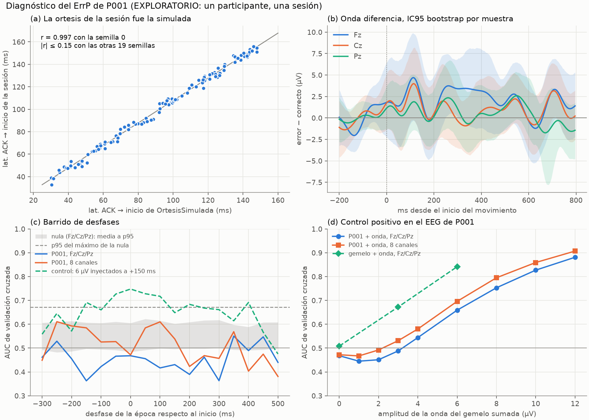

# Diagnóstico: ¿por qué el detector de ErrP no encontró nada en P001?

> **EXPLORATORIO.** Un participante, una sesión (5 de octubre de 2026, casco Unicorn real). Nada de esto se generaliza. Solo hay cifras y figuras agregadas: ni épocas ni EEG crudo de P001 están en el repositorio (los datos viven en `resultados/` y el XDF, ambos fuera de git).
> Todo sale de `python estudios/diagnostico_errp_p001.py --xdf <archivo.xdf>` (semilla 0, ~10 min; `--rapido` da una revisión en ~1 min con otros p). Detalle numérico en `resultados/diagnostico_errp_p001.json`.

## Respuesta corta

1. **Según los registros, la calibración de ErrP no tuvo ningún movimiento visible que juzgar.** La sesión usó la órtesis **simulada** (la latencia ACK → inicio de los 120 pasos es la de `hardware.latencia_mecanica_simulada(seq, semilla=0)`: r = 0.997, contra |r| ≤ 0.15 con otras 19 semillas) y el flujo `Estado` no trae **ni un evento `mano`** (no se usó `--mano-virtual`). `docs/DOMINGO.md` y `mano_virtual.py` piden esa bandera justo para calibrar el ErrP con `--ortesis-sim`. Sin movimiento no hay error que el piloto perciba, y la etiqueta «error» no tiene correlato en el EEG.
2. **El EEG es compatible con eso:** ningún canal × ventana pasa con corrección, el `DetectorErrP` completo no supera su nula de etiquetas permutadas y ningún desfase de la época (−300 a +500 ms) da señal.
3. **Aparte**, y aun con movimiento visible, este registro veía poco: con 36 errores y este ruido, la onda del gemelo (6 µV) sumada al EEG de P001 solo da AUC ≈ 0.66–0.70 y el detector completo sale con BA 0.58. El CP3 (BA ≥ 0.75 con especificidad ≥ 0.90) pide un AUC ≈ 0.86 (modelo binormal, orientativo).



## Qué se midió

| Dato | Qué es |
|---|---|
| `calibracion_errp_6_sub_P001_ses_S001_task_Default_run_001.npz` | 120 épocas de 1 s (−0.2 a 0.8 s del inicio del movimiento, filtro 1–10 Hz + notch, línea base de 200 ms), 8 canales; `y` = 1 si el movimiento contradijo al cue (36), 0 si no (84). Reconstruida del XDF con `desde_xdf.py`; recortada de nuevo del EEG continuo sale idéntica (diferencia máxima 0 µV). |
| `sesion_xdf_6_..._estado.jsonl` | Eventos de `Estado` (3 checkpoints, 162 cues) y marcadores. |
| XDF de LabRecorder | 615 s de EEG (154 035 muestras, 250.26 Hz efectivos, **sin un hueco**), IMU, `Marcadores`, `Paso`, `Estado`. |

**Nulas.** El plan de la calibración mezcla al azar, en cada bloque de 20 ensayos, 10 pares por cue con 3 errores por cue; las etiquetas de error son entonces intercambiables *dentro de cada (bloque × cue)* (12 estratos de 10 ensayos con 3 errores). Todas las pruebas permutan dentro de esos estratos (los p son de permutación, sin supuestos de normalidad) y las comparaciones múltiples se controlan con el máximo de |t| (o del AUC) sobre toda la familia. Las etiquetas coinciden con los cues grabados en `Estado`.

**Reproducción del CP3.** Con las épocas reconstruidas, `DetectorErrP.ajustar` da AUC de validación cruzada 0.512 / 0.507 / 0.496 / 0.474 en sus cuatro configuraciones (sens 0.03, espec 0.95, BA 0.49 eligiendo Fz/Cz/Pz con dos vistas; la sesión eligió «8 canales, dos vistas» y reportó 0.06 / 0.90 / 0.48). No es idéntico —las épocas en vivo y las reconstruidas difieren en detalles y las cuatro AUC son indistinguibles de 0.5—, pero es el mismo veredicto.

## Resultados por hipótesis

### H0 (añadida). ¿Qué órtesis usó la sesión y se veía el movimiento?

- Latencia ACK → inicio de 120 pasos: 33 / 104 / 156 ms (mínimo / mediana / máximo; la simulada va de 30 a 150). Correlación con la simulada de semilla 0: **r = 0.9972** (desfase fijo 7.8 ms, sd 2.7 ms por la telemetría); con las otras 19 semillas, |r| ≤ 0.147. Con una órtesis real esa latencia no es función de `seq`.
- CP1: ACK mediana 8.5 ms, MAD 1.0, p95 10.2; `OrtesisSimulada` (8 ms, jitter 1.5) da en teoría 8.0 / 1.0 / 10.5. Compatible, pero no basta por sí solo.
- `Estado`: 3 checkpoints y 162 cues; **0 eventos `mano`**, 0 eventos de lazo. Los 162 cues llevaron señal visual (ninguno con `--cue-sin-visual`).
- Control por EEG (débil): el promedio de los 120 movimientos deja 2.25 µV pico a pico en PO7/Oz/PO8 (50–400 ms) contra un piso de 1.59 µV (p95 2.37; p = 0.056); el cue, 1.68 µV (p = 0.39). Ninguno pasa, pero el cue (una palabra que cambia por otra del mismo color y tamaño) casi no cambia la luminancia: **este control no distingue «no se vio» de «no se midió»**.
- **Se sostiene con los registros.** Falta confirmarlo con quien estuvo en la sala (qué había en la pantalla del piloto); si una órtesis física se movió por otra vía, no queda registro.

### H1. ¿Hay señal?

- Onda diferencia error − correcto (36 contra 84): Fz va de −0.29 µV (a 184 ms) a **+3.74 µV (a 260 ms)**; Cz de −0.92 (332 ms) a +2.22 (544 ms); Pz de −0.69 (344 ms) a +2.58 (548 ms). El pico de Fz es **positivo** donde una Ne sería negativa.
- Ventanas fijadas de antemano (Ne 200–350 ms y Pe 300–500 ms, en Fz y Cz; IC95 bootstrap de 2000 remuestreos, p de permutación con 5000):

| Ventana | Canal | error − correcto (µV) | IC95 | d | p | p corregido (4 pruebas) |
|---|---|---|---|---|---|---|
| Ne | Fz | +3.03 | [+0.13, +6.13] | +0.36 | 0.059 | 0.177 |
| Ne | Cz | +0.51 | [−2.38, +3.36] | +0.07 | 0.743 | 0.986 |
| Pe | Fz | +2.79 | [−0.68, +6.62] | +0.33 | 0.154 | 0.361 |
| Pe | Cz | +0.32 | [−2.37, +3.11] | +0.05 | 0.822 | 0.996 |

- Las 96 medias de 50 ms (8 canales × 12 ventanas de 100 a 700 ms): mayor |t| = 2.18 (Fz, desde 250 ms) contra 3.44 del 5 % de la nula del máximo. **Pasan 0 con corrección**; sin corregir pasan 3 (por azar se esperan 4.8).
- Fiabilidad entre mitades de la onda diferencia (Fz/Cz/Pz): r = +0.04 (nula −0.00, p95 +0.41; p = 0.43).
- **`DetectorErrP` completo** (sus cuatro configuraciones, 20 permutaciones): AUC observada máxima 0.512; con etiquetas permutadas, el máximo de las cuatro tiene media 0.529 y p95 0.672 (p = 0.52).
- Sensibilidad al preprocesamiento (mayor |t| de las 96 medias, p corregido): config 1–10 Hz con línea base 2.18 (0.69); sin línea base 2.77 (0.29); 0.5–20 Hz 2.53 (0.33); 1–6 Hz 2.18 (0.65); referencia al promedio de los 8 canales 2.73 (0.37). Nada se escondía en el filtro, la línea base ni la referencia.
- **Veredicto:** sin evidencia de señal, con la salvedad de potencia (H5): la diferencia mínima que esta muestra detecta con 80 % de potencia es 4.3 µV por ventana (d = 0.56; 5.2 µV con la corrección de 4 pruebas).

### H2. Desfase de la época

AUC de validación cruzada (5 pliegues × 2; ventanas de 100 ms de 100 a 700 ms + LDA con encogimiento; 200 permutaciones) con la época cortada de −300 a +500 ms del inicio:

| | AUC máximo (desfase) | AUC en desfase 0 | media de la nula | p95 del máximo de la nula | p corregido del máximo |
|---|---|---|---|---|---|
| Fz/Cz/Pz (18 características) | 0.550 (+350 ms) | 0.468 | 0.493 | 0.661 | 0.68 |
| 8 canales (48 características) | 0.611 (−250 ms) | 0.472 | 0.495 | 0.670 | 0.38 |

**Ningún desfase da señal.** Lo que el barrido sí encuentra: con 6 µV del gemelo inyectados 150 ms *después* del inicio, el AUC sube a 0.75 (con el máximo en 0 ms, no en +150) y se mantiene entre 0.57 y 0.75 de −250 a +400 ms (las ventanas cubren 600 ms: el barrido sirve para saber si hay señal, no para afinar la latencia a menos de ~150 ms); en los extremos (−300 y +500 ms) baja a 0.56 y 0.48. Además: **la latencia ACK → movimiento de esta sesión es la simulada, así que no dice nada de la órtesis real** (hay que medirla con la ESP32; la mano virtual añade ~20–40 ms de dibujo sin medir con fotodiodo, según `mano_virtual.py`).

### H3. Calidad y fatiga

- Sin canales planos, saturados ni ruidosos; rms de las épocas (1–10 Hz): Fz 10.2, C3 8.7, Cz 8.7, C4 7.1, Pz 8.7, PO7 7.3, Oz 6.0, PO8 5.9 µV. Pico a pico por época: mediana 34.9, p95 79.1 µV; **1 época de 120 pasa de 100 µV** (0 de errores y 1 de correctos; Fisher p = 1.0).
- IMU: giro máximo por época, mediana 5.2 grados/s, p95 5.6, máximo 11.3; **ninguna** pasa de 20.
- Alfa occipital por bloque de 20 ensayos entre el del primero: 1.00, 1.01, 1.09, 1.05, 1.24, 1.22 (el semáforo PILOTO avisa desde 1.5): el alfa sube ~22 % hacia el final, sin cruzar el aviso.
- 60 Hz (fracción de potencia en todo el registro): Cz 0.49 y Fz 0.37 son los altos (umbral del CP1: 0.5); el filtro de 1–10 Hz y el notch la quitan casi toda.
- Primeras 60 contra últimas 60: rms mediano 6.53 contra 6.92 µV (Spearman con el ensayo −0.02, p = 0.79); AUC por mitad 0.37 y 0.54 (Fz/Cz/Pz; nula media 0.495, p95 0.668) y 0.48 y 0.53 (8 canales; nula 0.500, p95 0.660): ninguna mitad supera su nula (p ≥ 0.33).
- **Veredicto:** no explican el NO GO. Que las AUC de la validación cruzada queden por debajo de 0.5 es el sesgo normal del método (la nula también queda en ~0.49).

### H4. Diseño

- 36 errores en 120 épocas (30 %), 6 por cada bloque de 20 y 18 por dirección (racha máxima: 2). Cue → ACK 1.50–1.51 s; ACK → inicio 33–156 ms; un ensayo cada 2.48 s (el cue siguiente llega 0.07 s después de que termina la época). El paso (±0.15 del recorrido en 250 ms) es mayor que `PASO_VISIBLE` (0.08).
- **Veredicto:** el diseño no es el problema; la visibilidad sí (H0). Lo único flojo es el número: 36 errores dan poca potencia (H5).

### H5 (añadida). Control positivo y sensibilidad

Se suma al EEG **continuo** de P001, en el inicio de los 36 movimientos erróneos, la onda diferencia del gemelo (`cerebro_sintetico.plantilla_errp`: Ne ~250 ms, Pe ~360 ms, pesos `W_ERRP`; a 6 µV, pico +5.8 y valle −3.7 µV en el canal de peso 1) y se pasa por la misma cadena (marcas, filtro, línea base, pruebas). La forma es supuesta, no medida en P001.

| Amplitud (µV) | mayor \|t\| | ventanas que pasan (de 96) | AUC Fz/Cz/Pz | AUC 8 canales | gemelo, mismo clasificador (Fz/Cz/Pz; 8 can.) |
|---|---|---|---|---|---|
| 0 | 2.18 | 0 | 0.468 | 0.472 | 0.508; 0.539 |
| 3 | 2.69 | 0 | 0.488 | 0.531 | 0.672; 0.640 |
| 4 | 3.00 | 0 | 0.544 | 0.580 | — |
| 6 | 3.60 | 1 | 0.659 | 0.696 | 0.841; 0.810 |
| 8 | 4.20 | 3 | 0.753 | 0.795 | — |
| 10 | 4.80 | 4 | 0.827 | 0.859 | — |
| 12 | 5.40 | 6 | 0.881 | 0.907 | — |

- La cadena **sí encuentra un ErrP inyectado** (desde 6 µV pasa la prueba con corrección; con 12 µV, 6 ventanas), así que el NO GO no viene de un error de marcas, filtro ni detector con EEG real. Pero con **6 µV —la amplitud con que el gemelo da BA 0.81— el AUC en el ruido de P001 es 0.66–0.70** y el `DetectorErrP` completo da sens 0.22, espec 0.93, **BA 0.58** (NO GO); con 12 µV, BA 0.91. No se corrió con valores intermedios. El ruido de P001 en los canales del ErrP es mayor que el del gemelo (Cz y Pz 8.7 contra ~6 µV).
- Más épocas (ruido de P001 en instantes al azar de todo el registro, 30 % de errores con la onda inyectada, media de 4 sorteos; el AUC varía ±0.03 entre sorteos): con 6 µV, 120 / 240 / 360 épocas dan AUC 0.70 / 0.75 / 0.73 (Fz/Cz/Pz) y 0.69 / 0.78 / 0.80 (8 canales); con 3 µV, 0.55 / 0.57 / 0.63 y 0.53 / 0.60 / 0.67. Más épocas ayudan, sobre todo a los 8 canales, pero no sustituyen a un ErrP de tamaño suficiente.
- Diferencia mínima detectable (80 % de potencia, nivel 0.05; sd entre ensayos 7.8 µV): 4.3 µV con 36 errores (120 épocas), 3.4 con 60 (200), 2.7 con 90 (300), 2.4 con 120 (400).
- Traducción orientativa (modelo binormal de varianzas iguales, **no medida**): con especificidad 0.90, BA 0.75 pide AUC ≈ 0.86; AUC 0.70 da BA ≈ 0.60 y AUC 0.80, BA ≈ 0.68.

## Qué se sostiene y qué se descarta

| Hipótesis | Veredicto |
|---|---|
| H0: la sesión no mostró el movimiento (órtesis simulada, sin mano virtual) | **Se sostiene** con los registros; confirmar con quien estuvo en la sala |
| H1: hay un ErrP que el detector no ve | **Sin evidencia de ErrP** (0 de 96 con corrección; detector dentro de su nula); potencia limitada |
| H2: época desfasada | **Se descarta en esta grabación** (ningún desfase supera la nula; el barrido sí encuentra una señal inyectada). La latencia real de la órtesis sigue sin medirse |
| H3: calidad / fatiga | **Se descarta como causa** (canales sanos, 1 época sobre 100 µV, sin giro, alfa bajo el aviso, mitades iguales) |
| H4: diseño (30 %, percepción) | **El diseño no es la causa; la visibilidad sí (H0)**; 36 errores es poco |
| H5: cadena de cálculo defectuosa | **Se descarta**: encuentra el ErrP inyectado. Pero con el ruido de P001 el CP3 exige un ErrP bastante mayor que el del gemelo |

## Qué cambiar en la próxima sesión real

1. **Que el movimiento se vea, y comprobarlo antes.** Órtesis real a la vista del piloto, o `python orquestador.py real --ortesis-sim --mano-virtual` con `mano_virtual.py --pantalla N` (o `demo.py lanzar ... --mano-virtual --pantalla N`). Diez segundos antes de calibrar: cinco movimientos al azar y el piloto dice en voz alta «abre» o «cierra»; 5 de 5 para seguir. Y en el sistema (propuesta, **no implementada**): que `calibrar_errp` avise en grande cuando `--ortesis-sim` va sin `--mano-virtual`, y que `detencion.pasos(3)` y el árbol del CP3 de `docs/DOMINGO.md` pregunten «¿se veía moverse algo?» antes de «repetir con `--solo-errp`, con el piloto mirando la órtesis» (con la simulada no hay nada que mirar).
2. **Más épocas:** pasar de 120 a 240 o más (`--ensayos_errp 240`, ~10 min; 72 errores) con una pausa a la mitad. La diferencia mínima detectable baja de 4.3 a ~3.1 µV y la elección de canales y vistas (hoy ruido: las cuatro AUC dan 0.47–0.51) se vuelve estable. No bajar el criterio del CP3.
3. **Desfase:** conservar el inicio por telemetría (o el `inicio` de la mano virtual), medir la latencia de pantalla con un fotodiodo si se puede, y correr el barrido (`diagnostico_errp_p001.py`) al terminar; fijar de antemano Ne 200–350 ms y Pe 300–500 ms en Fz/Cz.
4. **Canales:** no cambiar el montaje. Fz es el canal con más ruido (10.2 µV rms, parpadeos); decidir canales con ≥ 240 épocas, no con 120.
5. **Esperar poco del CP3 con el ruido de P001:** aun con movimiento visible, un ErrP como el del gemelo daría BA ~0.6. Si con movimiento visible comprobado y ≥ 240 épocas la BA sigue < 0.65, entonces sí es evidencia (de un participante) de que este montaje no lo detecta, y toca el plan B.
6. Guardar XDF, `.npz` y `.jsonl` de la sesión y correr este script justo después de CAL_ERRP.

## Qué NO se puede concluir con un participante

- Que P001 **no tenga** ErrP, ni que el Unicorn no pueda detectarlo: no hubo estímulo visible registrado.
- Nada sobre la latencia ACK → movimiento de la órtesis real: esta sesión usó la simulada.
- Que «no se vio nada» es seguro: es una inferencia de los registros (sin mano virtual, con órtesis simulada), no una observación; el control por EEG es débil.
- Que el ErrP de P001 mida X µV: el control positivo usa la forma del gemelo y mide *sensibilidad*, no el ErrP real. Sus cifras (6 µV → AUC 0.66–0.70) valen para el ruido de esta sesión.
- Que los 4 pasos sean independientes: se miraron varias cosas en una sola sesión y los p son de familias distintas, sin corregir entre ellas.
- Nada de población: todo es una persona, una sesión.

## Reproducir

```bash
python estudios/diagnostico_errp_p001.py --xdf <archivo.xdf>                 # completo (~10 min)
python estudios/diagnostico_errp_p001.py --xdf <archivo.xdf> --rapido         # ~1 min, p's distintos
python estudios/diagnostico_errp_p001.py                                      # sin XDF: solo .npz y .jsonl (pasos 0, 1, 1b, 3 parcial, 4)
```

Las funciones reutilizables (`estratos_del_diseno`, `permutar_en_estratos`, `prueba_permutacion`, `bootstrap_onda_diferencia`, `efecto_minimo_detectable`, `auc_cv`, `escanear_desfases`, `ortesis_parece_simulada`, `inyectar_errp`, `curva_de_aprendizaje`) tienen su prueba sin hardware en `pruebas.py` (`diagnostico_errp_p001`).
